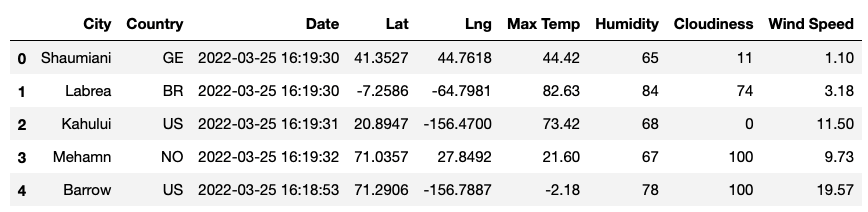
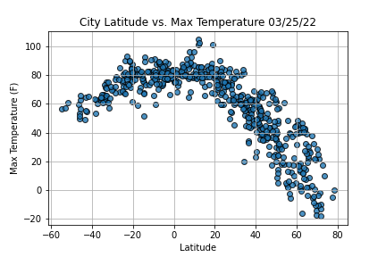
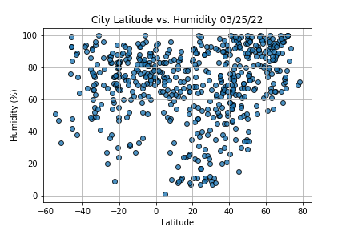
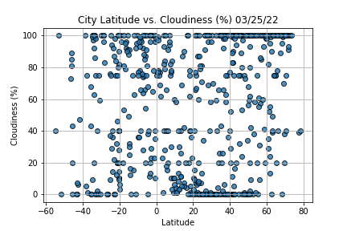
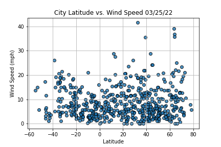
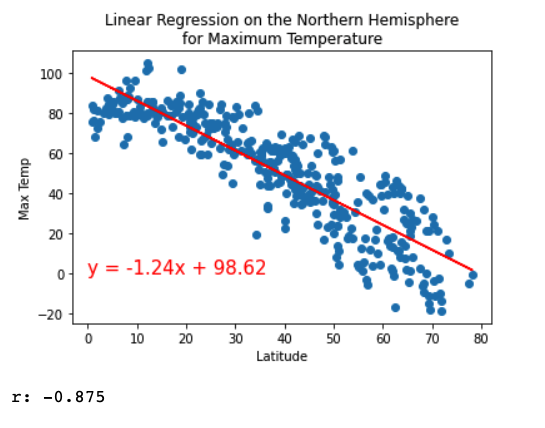
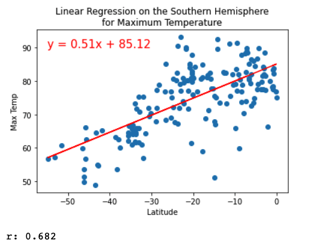
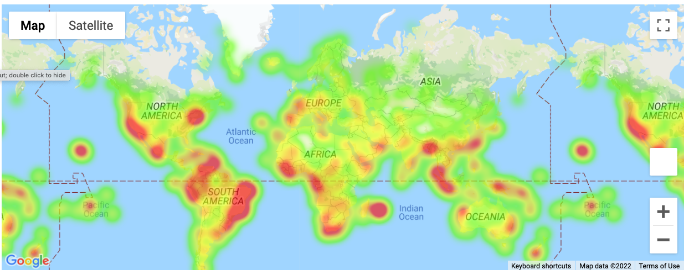

# World_Weather_Analysis
## Overview of the Project
The basic goal of this project was to collect and analyze weather data across cities worldwide. In doing so, a tool was built to provide recommended cities and hotels based on clients' weather preferences.

### Resources
OpenWeatherMap API
Google Maps and Places API

## Data Collection
The data was collected using a combination of operations with NumPy, citipy, OpenWeatherMap API calls, and parsing JSON data. First, more than 1,500 random latitude and longitude combinations were generated with the NumPy module. Next, the citypy module was used to identify over 500 cities located near combinations from the random lat/long set. Next, an API call was made using OpenWeatherMap to get the weather data for each unique city generated. The API call returned JSON data which was then parsed and added to a Pandas Dataframe. The first five rows are displayed below.  

## Exploratory Analysis
In order to better understand the relationship between latitude and various weather condidtions, scatter plots were created to visualize the data. 

From the scatterplots, the strongest correlation relationship appeared to be between latitude and maximum temperature. To better understand this relationship, first the nothern hemisphere and maximum temperature relationship and correlation were evaluated, and  then the southern hemisphere relationahip and correlation were evaluated. As can be seen in the images the northern hemisphere latitude had a stronger relationship with maximum temperature (r = -0.875) than did the suouthern hemisphere latidute (r= 0.682). In the northern hemisphere maximum temperatures were lower as latitude increased by moving closer to the north pole.  In the southern hemisphere, maximum temperatures trended lower as latitude became increasingly negative towards the south pole. The heatmap image provides a different visualization of this relationship using colors, where cooler colors (i.e. greens, blues, whites) signify cooler temperatures and warmer colors (yellows, oranges, reds) signify warmer temperatures.   

## Visualizing Travel Data
The next phase of the project was to provide interactive travel information to clients based on their temperature preferences. To achieve this functionality, first, input fields were used to request minimum and maximum temperature preferences from the users. Then code was written to filter the dataframe and then populate a heat map with information about each of those cities including a hotel recommendation. 

